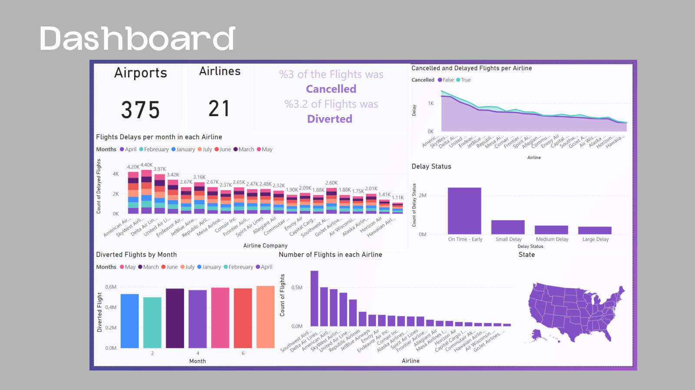
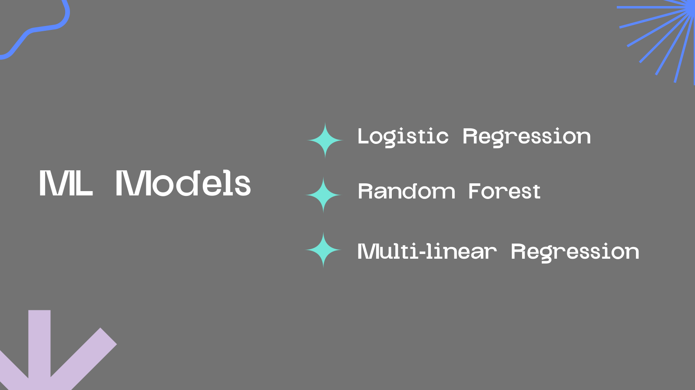
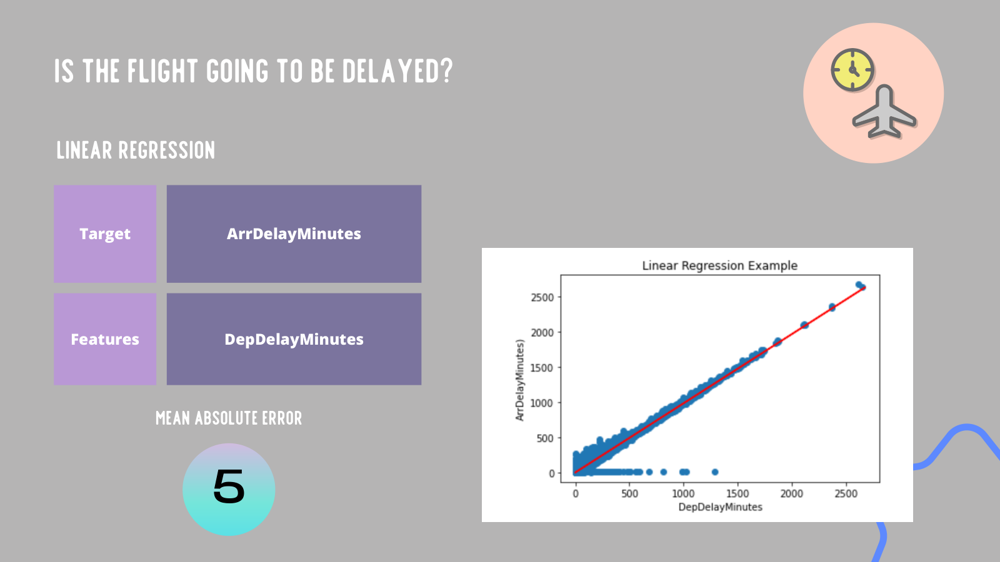
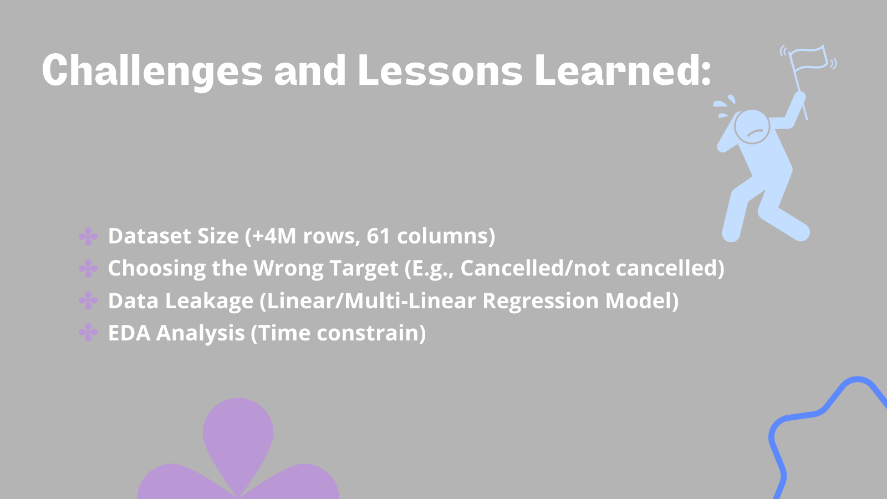

# Flight Delay Prediction
---
> End-to-end machine learning on **4.1M US flight records (2022, 61 features)** — combining
> **classification** (will this flight be delayed?) with **regression** (how many minutes late?)
> using scikit-learn, plus a Power BI dashboard of national delay patterns.
> Completed as project of the **Big Data & AI Bootcamp**.

## Overview

---
> Flight delays cost airlines and passengers time and money. Working from a 2022 airline
on-time performance dataset of over 4 million flights, this project engineers a binary
delay target, trains and compares classification models on ~986k flights, and builds
regression models to estimate the actual delay in minutes — ending with a dashboard that
surfaces where and when delays cluster.

---

> The work is organized as two connected modeling tasks:

| Task | Business Question |
|------|------------------|
| Delay Classification | Can we predict whether a flight will arrive late before it happens? |
| Delay Regression | How many minutes of arrival delay should be expected, given departure and flight features? |

## Technologies Used
---

- Python 3
- Pandas
- NumPy
- Scikit-learn
- Matplotlib & Seaborn
- Jupyter Notebook (Google Colab)
- Power BI

## Key Findings
---

- Engineered a clean binary delay target from `ArrDelayMinutes` over 986,229 flights with a 75/25 train-test split and standard scaling.
- Logistic Regression delivered the strongest classification results, with Random Forest as a close ensemble alternative.
- Multi-linear and Random Forest regression modeled delay minutes from departure-time and airtime features.
- Key lessons: dataset scale (4M+ rows), avoiding data leakage between departure and arrival delay features, and time-constrained EDA.

## Screenshots
---

### ML Models

---
### Delay Regression Results

---
### Challenges & Lessons Learned

## Team Members
---
- Eman Alamari
- Maha Alhazzani
- Reema Alaswad
- Raghad Aleisa
- Aljohara Alkanhal
